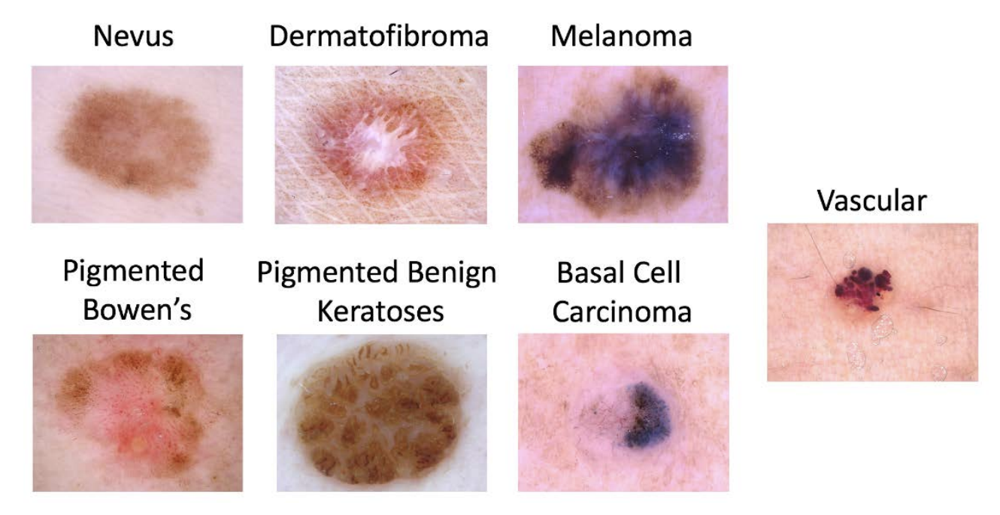

# Binary Skin Cancer Classification
This project is a binary classification task to classify skin cancer images into two classes: Benign and Malignant, which is part of the course project for the Computer Aid Diagnosis course at the University of Girona.

# Table of Contents
1. [Introduction](#introduction)
2. [Dataset](#dataset)
3. [Data Preprocessing](#data-preprocessing)
4. [TODO](#todo)
5. [Model](#model)
6. [Training](#training)
7. [Evaluation](#evaluation)
8. [Results](#results)
9. [References](#references)

# Introduction
Skin cancer is the most common type of cancer, and early detection is crucial for successful treatment. The goal of this project is to develop a binary classification model to classify skin cancer images into two classes: Benign and Malignant.

# Dataset
The input data are dermoscopic images in JPEG format. The distribution of disease states represents a
modified real world setting whereby there are more benign lesions than malignant lesions, but an overrepresentation of malignancies. The lesion images come from the HAM10000 Dataset (ViDIR Group,
Medical University of Vienna), the BCN_20000 Dataset (Hospital Clínic de Barcelona) and the MSK Dataset
(ISBI 2017), hence images were acquired with a variety of dermatoscope types and from different anatomic
sites. Images were acquired from a historical sample of patients that presented for skin cancer screening
from several different institutions.

The binary problem of classifying Nevus images vs all the others containing more than 15,000 images.

# Data Preprocessing

# TODO
- [ ] Data Preprocessing
    - [x] Hair Removal
    - [ ] Masking with Segmentation
- [ ] Feature Extraction
    - [x] Color Histogram
    - [x] Local Binary Pattern
    - [ ] Gray Level Co-occurrence Matrix
    - [x] Histogram of Oriented Gradients
    - [ ] SIFT
    - [ ] Bag of Visual Words
- [ ] Model
    - [x] Xgboost
- [x] Training 
- [x] Evaluation
- [ ] Results

# Model

# Training

# Evaluation

# Results
